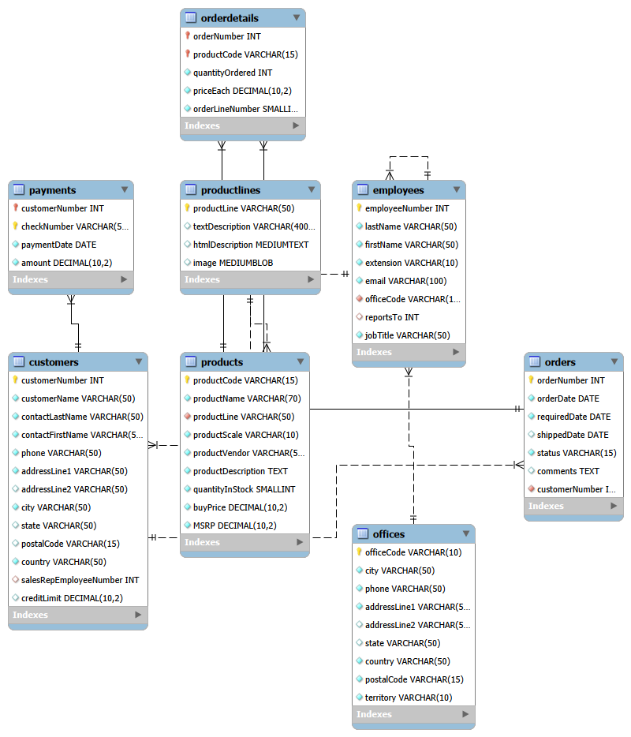

# sql-classic-models-analysis
## **Project Goal**

The goal of this project is to trabsform raw data from sales system into a comprehensive **MAster Fataset** ready for ML

## **1. Database Schema Overview & EER Diagram**
This project  uses the classicmodels database, a standard industry schema representing global sales operations. The system consists of eight interconnected tables, including customers, employees, offices, orderdetails, orders, payments, productlines and products. The database use the **InnoDB engine** with strict **Foreign Key constrains** to ensure the data remains accurate across all tables.

## **2. ML Data Preparation**

### **Part 1:** Customer Identity & Demographics
The foundation of dataset is build using the **customers** table
- **Logic:** I extract the unique customernumber along with key personal details such as customerName...
- **Purpose:**

### **Part 2:** Transcactional Intelligence & RFM Analysis

### **Part 3:** Order Line (OL) & Producy Behavior

## **3. Busines Insights (SQÇ Analysis)**
