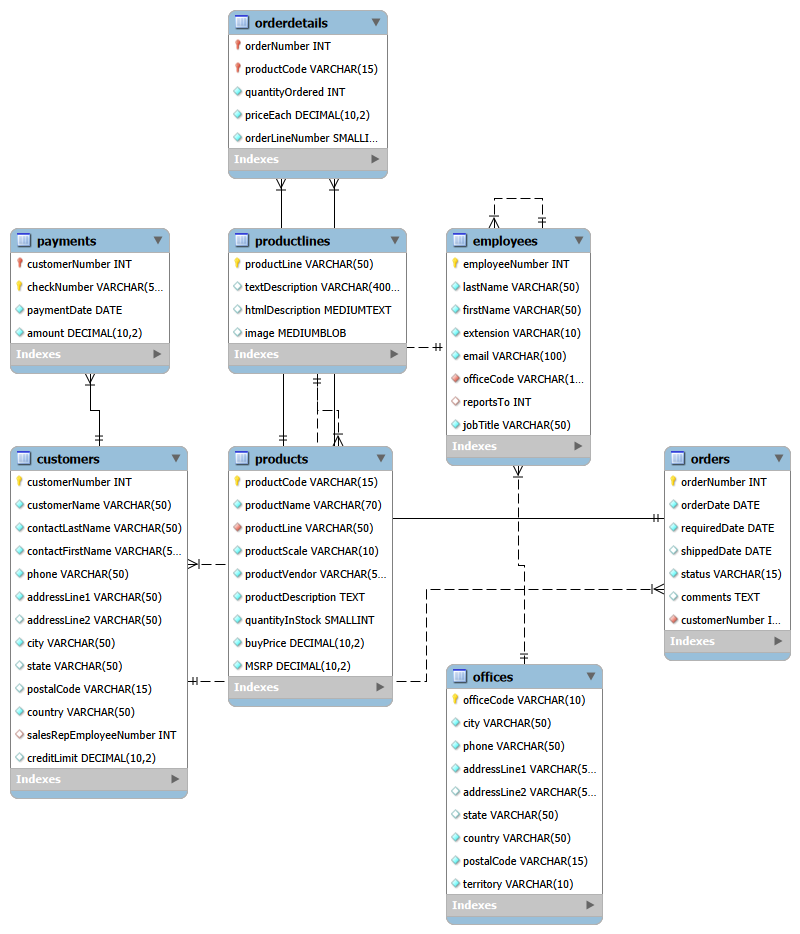

# sql-classic-models-analysis
## **Project Goal**

The goal of this project is to transform raw data from sales system into a comprehensive **Master Dataset** ready for ML


## **1. Database Schema Overview & EER Diagram**
This project  uses the classicmodels database, a standard industry schema representing global sales operations. The system consists of eight interconnected tables, including customers, employees, offices, orderdetails, orders, payments, productlines and products. The database use the **InnoDB engine** with strict **Foreign Key constrains** to ensure the data remains accurate across all tables.




## **2. ML Data Preparation (Customer -Level Pipeline)**

The objective of this project is to transform raw sales data into a comprehensive **Master Dataset** that is 100% ready Machine Learning use. Iam responsible for the **feature engineering and data architecture** required to make a Customer Segmentation model successful.

**The "Right Question" Logic**

Before starting, I had to answer a citical question: Which subject areas do we need to prepare? To support a segmentation use case, I identified and consolidated four key areas into  a single, customer-level view:
- **Customer Personal Details** (The Identity Layer)
- **Customer RFM Metrics** (Behavioral Layer)
- **Transaction Details** (Sales & Orders)
- **Order Line Details** (Product preferences)

- I specifically prepared this data at the **Customer Level** because segmentation requires every row to represent one unique customer, with all their details spread across multiple columns.

---

**Building the Pipeline**


### **Part 1: Customer Identity & Demographics**
I estabilished the foundation by creating the `analysis.CustomerBasicInfo` table. This extracts the unique `customerNumber` and other identity and demographic features like `customerName, contactFirstName, contactLastName,phone, country, creditLimit`.

```
CREATE DATABASE IF NOT EXISTS analysis;

CREATE TABLE analysis.CustomerBasicInfo
AS
SELECT 
	customerNumber,
	customerName, 
    contactFirstName, 
    contactLastName,
    phone,
    country,
    creditLimit
FROM customers;
```
---

### **Part 2: Understanding Customer Buying Habits (RFM Analysis)**

This layer adds behavioral depth to the master dataset. While in Part 1 I estabilished who the customer is, this part fosuces on how they actually interact with the business. I used the **RFM method** (*Recency, Frequency, and Monetary) to prepare the most important features for a segmentation model.

- **Step-by-Step Logic:**
1. **Gathering Transaction Totals:** I joined the `orders`and `orderdetails`tables using the `orderNumber`to see the complete history for every customer.

2. **Calculating Key Values**: I calculated the total count of orders (**Frequency**) and the total lifetime (**Monetary**).

3. **Measuring Time (Recency):** I added a `recency`column to calculate the days passed since each customer`s `lastpurchasedate`.

4. **Managing Database Safety:** To perform these updates accurately, I briefly disabled "safemode" (`SET SQL_SAFE_UPDATES =0`) and reactivated it immediately after. 

5. **Deeper Behavioral Insights:** I created an additional table to calculate the **average order value** and **average quantity**. This helps a machine learning model distinguish between customers who place many small orders and those who make large, bulk purchases.

```
--1. Building the RFM foundation (Frequency and Monetary)

CREATE TABLE analysis.customerrfm AS
SELECT customerNumber,
MAX(O.OrderDate) as lastpurchasedate,
COUNT(O.orderNumber) as frequency,
SUM(OD.quantityOrdered * OD.PriceEach) as monetory
FROM classicmodels.orders O
JOIN classicmodels.orderdetails OD
ON O.orderNumber = OD.orderNumber
GROUP BY customerNumber;

--2. Calculating Recency
ALTER TABLE analysis.customerrfm
ADD recency INT;

-- Managing environmental safety to allow the update

SET SQL_SAFE_UPDATES=0;
UPDATE analysis.customerrfm
SET recency = datediff(CURDATE(),lastpurchasedate);

SET SQL_SAFE_UPDATES=1;

--3. Adding Additional Metrics (Averages)

SET SQL_SAFE_UPDATES=0;
CREATE TABLE analysis.customeradditionalmetric  AS
SELECT customerNumber, 
avg(OD.quantityOrdered * OD.PriceEach) AS averageordervalue,
avg(OD.quantityOrdered) AS averageorderquantity
FROM classicmodels.orders O
JOIN classicmodels.orderdetails OD
ON O.orderNumber = OD.orderNumber
GROUP BY customerNumber;

```
---

### **Part 3:** Order Line (OL) & Producy Behavior

In this final technical phase I move from "how much" customers spend to **"what"**they are actually buying.
By creating order-line level details, I can identify which product categories a customer is most (or least) interested in.

- **Step-by-Step Logic:**
1. **Connecting the Details:** I joined three tables -`orders, orderdetails,` and `products`  to see the specific items associated with every customer

2. **Product Line Pivoting:** I used Pivot logic `(using SUM(CASE WHEN...))` to transform granular transaction rows into clean, customer-level columns. This allows us to see total spending across all seven product lines (such as `Classic Cars`, `Motorcycles`,`Planes`, etc.)

3. **The Results:**  I created the `analysis.customerproductlines`table, which provides a clear "Interest Profile" for every customer


```
-- I join 3 tables to pivot sales data into customer-level features.

CREATE TABLE analysis.customerproductlines
SELECT customerNumber,
SUM(CASE WHEN productline = 'Classic Cars'
THEN OD.quantityOrdered *OD.PriceEach ELSE 0 END)
AS ClassiccarsSales,
SUM(CASE WHEN productline = 'Motorcycles'
THEN OD.quantityOrdered *OD.PriceEach ELSE 0 END)
AS MotorcycleSsales,
SUM(CASE WHEN productline = 'Planes'
THEN OD.quantityOrdered *OD.PriceEach ELSE 0 END)
AS PlaneSales,
SUM(CASE WHEN productline = 'Ships'
THEN OD.quantityOrdered *OD.PriceEach ELSE 0 END)
AS ShipsSales,
SUM(CASE WHEN productline = 'Trains'
THEN OD.quantityOrdered *OD.PriceEach ELSE 0 END)
AS TrainsSales,
SUM(CASE WHEN productline = 'Trucks and Buses'
THEN OD.quantityOrdered *OD.PriceEach ELSE 0 END)
AS TruckandBusesSales,
SUM(CASE WHEN productline = 'Vintage Cars'
THEN OD.quantityOrdered *OD.PriceEach ELSE 0 END)
AS VintageCarsSales
FROM
classicmodels.orders O
JOIN classicmodels.orderdetails OD
on O.orderNumber= OD.orderNumber
JOIN classicmodels. products P
ON P.productCode= OD.productCode
GROUP BY customerNumber;

SELECT * 
FROM analysis.customerproductlines;
```
---

### **FINAL STEP:** Assembling the Master Dataset

This is the most critical step of my project where I combine all four prepared tables into one Massive Dataset.

1. **Left Join Logic:** I used LEFT JOIN starting from the customerbasicinfo table. This insures that I retain all information from the original customer list.

2. **Data Integrity Check:** Important part of my process was veryfying the row counts. The final table must have the exact same number of rows as the basic info tables. This ensures that every customer is accounted for, regardless of their purchase history.

3. **The Results:** I created the `analysis.finaltableformachinelearning`. This table is now a high dimensional record where every row represents one unique customer, fully ready for analysis and machine learning
**

```
-- ASSEMLING THE MASTER DATASET FOR ML
-- Merging all layers/tables into he final "Master Dataset" using LEFT JOIN to ensure no customer is lost in the process.

CREATE TABLE analysis.finaltableformachinelearning
SELECT cf.* ,
rfm.frequency, 
rfm.monetary,rfm.recency,
amc.averageordervalue,
amc.averageorderquantity,
cpl.ClassiccarsSales,
cpl.MotorcycleSsales,
cpl.PlaneSales,
cpl.ShipsSales,
cpl.TrainsSales,
cpl.TruckandBusesSales,
cpl.VintageCarsSales
from customerbasicinfo cf
LEFT JOIN customerrfm rfm
on cf.customerNumber= rfm.customerNumber
LEFT JOIN customeradditionalmetric amc
on cf.customerNumber= amc.customerNumber
LEFT JOIN customerproductlines cpl
on cf.customerNumber= cpl.customerNumber;

--Final verification: This dataset is now 100% ready for Machine Learning use.

SELECT * FROM finaltableformachinelearning;
```


###**Conclusion:**
By transforming raw data into this structured **Master Dataset**, I have provided a verified, audit-reday foundation. 
This allows the bussiness to move directly into building a **Customer Segmentation** model with total confidencein the data´s integrity


---


## **3. Business Intelligence & Strategic Reporting**

[📂 View Complete SQL Script](./business_intelligence_queries)

To make this project complete, I am adding a section that use this dataset to solve 10 specific business requests. 
By running these quesries against the Classic Models , I can provide immediate answers to stakeholders regarding:
	- **Logist Audits:**  Identifying shipping delays and delivery performance.
	- **Revenue Audits:**  Identifying high-value customers and profitable product lines.
	- **Risk & Credit:** Comparing customer credit limits against actual habits.

### **1: Tracking Active Orders**
-**Logic:** Filtering the orders table identify transactions that are not yet "Shiped" or "Resolved" to monitor current operational status.
	
```
SELECT orderNumber, status, orderDate, customerNumber
FROM orders
WHERE status NOT IN ('Shipped', 'Resolved');
```


| Order Number | Status | Order Date | Customer Number |
 | :--- | :--- | :--- | :--- |
| 10167 | Cancelled | 2003-10-23 | 448 |
| 10179 | Cancelled | 2003-11-11 | 496 |
| 10248 | Cancelled | 2004-05-07 | 131 |
| 10253 | Cancelled | 2004-06-01 | 201 |
| 10260 | Cancelled | 2004-06-16 | 357 |
| 10262 | Cancelled | 2004-06-24 | 141 |
| 10334 | On Hold | 2004-11-19 | 144 |
| 10401 | On Hold | 2005-04-03 | 328 |
| 10406 | Disputed | 2005-04-15 | 145 |
| 10407 | On Hold | 2005-04-22 | 450 |
*Note: The results above shows a representative sample of active and cancelled records.*

**Analysis Note:** *This audit identified a total of **19 orders** requiring follow-up.

### **2: Geographic Market Footprint**
-**Logic:** Grouping customers by country to identify key regions for logistics optimization and market expansion
	
```
SELECT country, COUNT(*) AS totalCustomers
FROM customers
GROUP BY country
ORDER BY totalCustomers DESC;
```


| Country | Total Customers |
| :--- | :--- |
| USA | 36 |
| Germany | 13 |
| France | 12 |
| Spain | 7 |
| Australia | 5 |
| UK | 5 |
| Italy | 4 |
| New Zealand | 4 |
| Norway | 3 |
| Singapore | 3 |
*Results shown are a partial sample for demonstration purposes.*

** Analysis Note:** *This audit identifies the USA as a primary market, followed by a strong presence in Germany and France.
This data helps stakeholders make informed decisions regarding regional resource allocation and logistics planning.*

### **3: Inventory Risk: Low Stock Audit**
-**Logic:** Filtering the products table for items with a quantityInStock below a critical treshold (e.g.,1000 units) to prevent supply chain disruptions.
 Inventory Risk: Low Stock Audit

```
SELECT productName, productLINE, quantityInStock
FROM products
WHERE quantityInStock < 1000
ORDER BY quantityInStock ASC;
```


 | Product Name | Product Line | Quantity In Stock |
 | :--- | :--- | :--- |
 | 1960 BSA Gold Star DBD34 | Motorcycles | 15 | 
 | 1968 Ford Mustang | Classic Cars | 68 | 
 | 1928 Ford Phaeton Deluxe | Vintage Cars | 136 | 
 | 1997 BMW F650 ST | Motorcycles | 178 | 
 | Pont Yacht | Ships | 414 | 
 | 1911 Ford Town Car | Vintage Cars | 540 | 
 | 1928 Mercedes-Benz SSK | Vintage Cars | 548 | 
 | F/A 18 Hornet 1/72 | Planes | 551 | 
 | 2002 Yamaha YZR M1 | Motorcycles | 600 | 
 | The Mayflower | Ships | 737 | 
 | 1996 Peterbilt 379 Stake Bed with Outrigger | Trucks and Buses | 814 |
 | P-51-D Mustang| Planes | 992 |

**Analysis Note:** *This audit identifies high priority inventory items requiring immediate replenishment to avoid stockouts.*

### **4: Financial Audit: Spend vs. Credit Limit Discrepancy**
-**Logic:** Joining customers and payments to identify high-risk clients whose total spending exceeds their assigned creditLimit

```
SELECT c.customerName, c.creditLimit, SUM(p.amount) AS totalSpent
FROM customers c
JOIN payments p ON c.customerNumber=p.customerNumber
GROUP BY c.customerName, c.creditLimit
HAVING totalSpent> c.creditLimit;
```


 | Customer Name | Credit Limit | Total Spent | 
 | :--- | :--- | :--- | 
 | Atelier graphique | 21,000.00 | 25,814.36 | 
 | Signal Gift Stores | 71,800.00 | 80,180.98 | 
 | Australian Collectors, Co. | 117,300.00 | 180,585.07 | 
 | Baane Mini Imports | 81,700.00 | 104,224.79 | 
 | Mini Gifts Distributors Ltd. | 210,500.00 | 584,188.24 | 
 | Blauer See Auto, Co. | 59,700.00 | 75,937.76 | 
 | Mini Wheels Co. | 64,600.00 | 66,710.56 | 
 | Euro+ Shopping Channel | 227,600.00 | 715,738.98 | 
 | Danish Wholesale Imports | 83,400.00 | 107,446.50 | 
 | Saveley & Henriot, Co. | 123,900.00 | 130,305.35 |
*Note: The table above displays a representative sample of a full query results.*

** Analysis Note:** *This audit identified key accounts where actual transactions volume significantly exceeds acredit tresholds.*

 
### **5 : Sales Representative KPI Performance**
- **Logic:** Connecting employees, customers and payments to evaluate which sales reps are driving the most revenue, supporting data driven performance reviews

```
SELECT CONCAT(e.firstName,'',e.lastName) AS salesRep,
	   SUM(p.amount) AS totalRevenue
FROM employees e
JOIN customers c ON e.employeeNumber=c.salesRepEmployeeNumber
JOIN payments p ON c.customerNumber = p.customerNumber
GROUP BY salesRep
ORDER BY totalRevenue DESC;
```


| Sales Rep Name | Total Revenue (USD) |
| :--- | :--- | 
| Gerard Hernandez | 1,115,503.81 | 
| Leslie Jennings | 989,906.55 | 
| Pamela Castillo | 750,201.87 | 
| Larry Bott | 686,653.25 | 
| Barry Jones | 637,672.65 | 
| George Vanauf | 584,406.80 | 
| Loui Bondur | 569,485.75 | 
| Andy Fixter | 509,385.82 | 
| Peter Marsh | 497,907.16 | 
| Foon Yue Tseng | 488,212.67 |
*Note: The table above displays a representative sample of a full query results.*

**Analysis Note:** *This KPI report identifies our top-performing sales representatives by actual collected revenue*

### **6 :Revenue Performance by Customer (Top 5) **
- **Logic:** Joining the customers and payments tables to identify our most valuable partners by total spend. This fosuses on the Revenue in Dataset.

```
SELECT c.customerName, SUM(p.amount) AS totalPaid
FROM customers c
JOIN payments p ON c.customerNumber = p.customerNumber
GROUP BY c.customerName
ORDER BY totalPaid DESC
LIMIT 5;
```


| Customer Name | Total Paid (USD) | 
| :--- | :--- | 
| Euro+ Shopping Channel | 715,738.98 | 
| Mini Gifts Distributors Ltd. | 584,188.24 | 
| Australian Collectors, Co. | 180,585.07 | 
| Muscle Machine Inc | 177,913.95 | 
| Dragon Souveniers, Ltd. | 156,251.03 |

**Analysis Note:** *This report identifies the TOP 5 revenue contributors. 
By tracking these high-value accounts, we can ensure specialized logistics support and maintain high servis standart.*

### **7 : Logistics Audit: Late Shimpments & Ownership **
 **Logic:** I compare order dates to identify late shipments and join the customer and employee tables to determinate the responsible sales representative.
```
SELECT o.orderNumber, c.customerName, 
       CONCAT(e.firstName, ' ', e.lastName) AS salesRepName
FROM orders o
JOIN customers c ON o.customerNumber = c.customerNumber
JOIN employees e ON c.salesRepEmployeeNumber = e.employeeNumber
WHERE o.shippedDate > o.requiredDate;
```


 | Order Number | Customer Name | Sales Representative Name | 
 | :--- | :--- | :--- | 
 | 10165 | Dragon Souveniers, Ltd. | Mami Nishi |

**Analysis Note:** * This audit identified only one instance where the shipment date exceeded the deadline.
Identifying this single anomaly is essential for maintaining 100% accuracy.*

### **8 : Market Segmentation: Credit Risk Analysis **
 **Logic:** I use a CASE statement to perform a  tiered financial risk assessment, segmenting clinets
 to ensure process integrity and strategic credit control.

```
SELECT 
    CASE 
        WHEN creditLimit > 100000 THEN 'Platinum'
        WHEN creditLimit BETWEEN 50000 AND 100000 THEN 'Gold'
        ELSE 'Silver'
    END AS customerTier,
    COUNT(*) AS customerCount
FROM customers
GROUP BY customerTier;
```


| Customer Tier | Customer Count | 
| :--- | :--- | 
| Platinum | 31 | 
| Gold | 54 | 
| Silver | 37 |

**Analysis Note:** * This segmentation enables prioritized risk mitigation.*

### **9 : Highest Revenue by Product Line **
 **Logic:** I join the orderdetails and products table to calculate total revenue per category
 and identify our primary global revenue drivers.

```
SELECT p.productLine, SUM(od.quantityOrdered * od.priceEach) AS totalRevenue
FROM orderdetails od
JOIN products p ON od.productCode = p.productCode
GROUP BY p.productLine
ORDER BY totalRevenue DESC;
```


| Product Line | Total Revenue (USD) | 
| :--- | :--- | 
| Classic Cars | 3,853,922.49 | 
| Vintage Cars | 1,797,559.63 | 
| Motorcycles | 1,121,426.12 | 
| Trucks and Buses | 1,024,113.57 | 
| Planes | 954,637.54 | 
| Ships | 663,998.34 | 
| Trains | 188,532.92 |

**Analysis Note:** * Ranking product lines allows for optimized resource allocation
and ensures 100% fulfillment accuracy within the global OTO (Order-to-Order) workflow.*

### **10 : Organizational Hierarchy Audit (Self-Join) **
 **Logic:** I perform a self-join on the employees table to audit reporting lines and ensure clear qwnership in our global OTO workflows.

```
SELECT 
    CONCAT(e.firstName, ' ', e.lastName) AS employeeName,
    e.jobTitle,
    CONCAT(m.firstName, ' ', m.lastName) AS reportsToManager
FROM employees e
LEFT JOIN employees m ON e.reportsTo = m.employeeNumber;
```


| Employee Name | Job Title | Reports To Manager | 
| :--- | :--- | :--- | 
| Diane Murphy | President | NULL | 
| Mary Patterson | VP Sales | Diane Murphy | 
| Jeff Firrelli | VP Marketing | Diane Murphy | 
| William Patterson | Sales Manager (APAC) | Mary Patterson | 
| Gerard Bondur | Sale Manager (EMEA) | Mary Patterson | 
| Anthony Bow | Sales Manager (NA) | Mary Patterson | 
| Leslie Jennings | Sales Rep | Anthony Bow | 
| Leslie Thompson | Sales Rep | Anthony Bow | 
| Julie Firrelli | Sales Rep | Anthony Bow | 
| Steve Patterson | Sales Rep | Anthony Bow | 
| Foon Yue Tseng | Sales Rep | Anthony Bow | 
| George Vanauf | Sales Rep | Anthony Bow |
*Note: The table above displays a representative sample of a full query results.*

**Analysis Note:** * This audit guarantees internal accountibility and prevents operational gasps.*
